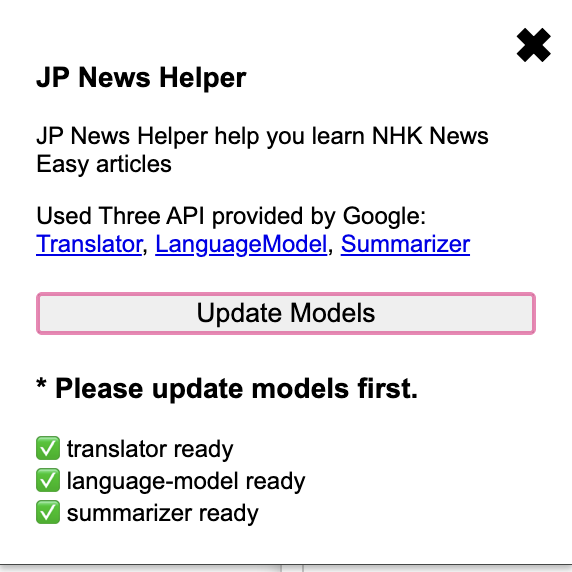

# JP NEWS Helper
---
JP News Helper is an extension to help users learn Japanese through [NHK News Easy](https://news.web.nhk/news/easy/).

## [Download extension from chrome web store](https://chromewebstore.google.com/detail/jp-news-helper/fnicbbaieoffijhppcobelcfilphgcon)

## [Intro Video](https://youtu.be/fV98dxeJ_vU)

## Example: 
Use extension on news from NHK NEWS WEB EASY(https://news.web.nhk/news/easy/)


## Features
| Action        | Function                                       |
|---------------|------------------------------------------------|
| **Summarize** | Summarize the news                             |
| **Translate** | Translate the news title and content, and show translations below the original lines |
| **Vocabulary**| Extract 10 key words to learn from the news     |
| **Chat**      | Chat in real time about the news               |

### Summarize
Use Chrome built-in Summarizer to summarize text. Option given below:
```
sharedContext: 'This is a news from NHK News',
type: 'teaser',
format: 'plain-text',
length: 'medium',
```

### Translate
Use Chrome built-in Translator to summarize text.

### Vocabulary
Use Chrome build-in Language Model to analyze the news and extract 10 vocabulary. InitialPrompts to give the model system info.
```
      initialPrompts: [
        {
          role: 'system',
          content:
            'You are a vocabulary extraction assistant give back the words in English, Chinese and Japanese. Also, you give back the detail descripiton of the words in English.',
        },
      ],
```
For the response given back from model to be `JSON` structure, give the schema below
```
const schema = {
    type: 'array',
    minItems: 10,
    maxItems: 10,
    items: {
      type: 'object',
      properties: {
        english: { type: 'string' },
        japanese: { type: 'string' },
        description: { type: 'string' },
      },
      // required: ['english', 'chinese', 'japanese'],
      required: ['english', 'japanese', 'description'],
      additionalProperties: false,
    },
  };
```

and put the schema to the prompt

```
    {
      responseConstraint: schema,
    }
```

### How to use locally:
1. Code preparation
```
git clone
npm install
npm run build // .ts file compile to .js file
node addVersion.js 0.1.13 // to add version on this extension
node moveFiles.js destination // to move files to destination folder
```
2. Upload extension
* Go to manage extensions (chrome://extensions/)
* Click **Load unpacked** and select the this code folder to upload
3. Start to use
* Go to [NHK News Easy](https://www3.nhk.or.jp/news/easy/) and choose a news then start to use JP NEWS Helper from the right top extension icon.
4. Upload models
* Press **upload models** button, it will tell background.js to download language models, respectively are Summarizer, Translator, Language Model.
5. Sidebar
* Press ctrl + j to toggle sidebar, in the sidebar, there are four function to interact with language model and give you more information about the news you are going to learn.
6. Beyond your mind
* Try to use chatbox to chat with language model for anything you want to know.

## Photos

### Extension Popup
First, press **update models** to download models [Summarizer](https://developer.chrome.com/docs/ai/summarizer-api), [Translator](https://developer.chrome.com/docs/ai/translator-api) and [Language Model](https://developer.chrome.com/docs/ai/prompt-api) built in Google Chrome, so you can use the feature via API to the models just in website.



### Summary
- 📝 **Summarize** → Summarize the news  


### Vocabulary
- 📚 **Vocabulary** → Extract 10 words to learn  


### Chat
- 💬 **Chat** → Use input at the bottom to chat with Language Model about the news.

